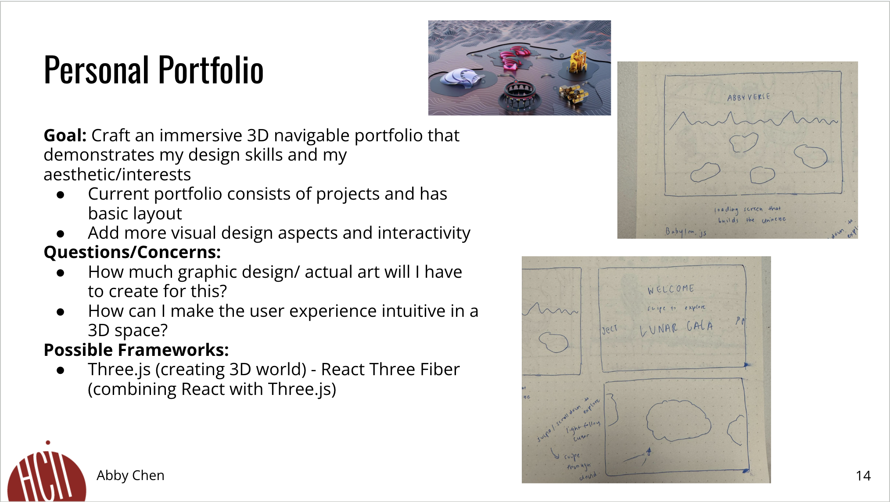
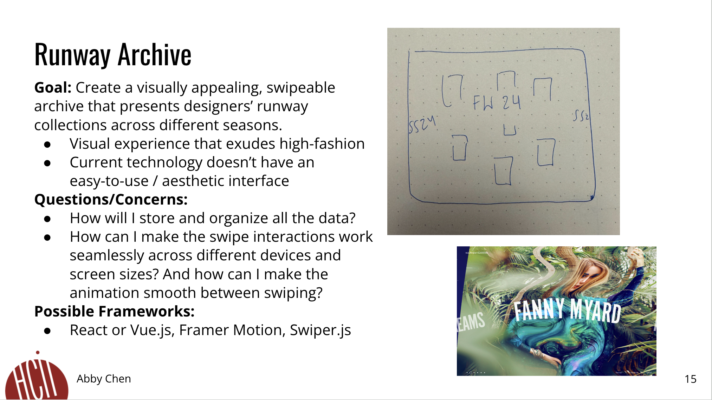
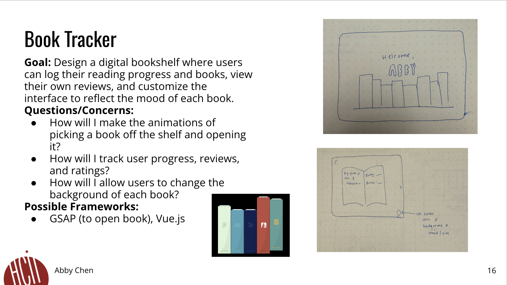

<mark>**Note that this document order from FP4 -> FP1**</mark>

<mark>Please sign up for the study</mark> at [https://tinyurl.com/pui-study](https://tinyurl.com/pui-study) to allow us to use your submission to create a better GenAI assistant for designers!

---

# **FP4 \- Final Project Writeup**

Feel free to refer to this [Markdown Cheat Sheet](https://www.markdownguide.org/cheat-sheet/) to make your writeup more organized, and you can preview your markdown file in VSCode [Markdown editing with Visual Studio Code](https://code.visualstudio.com/docs/languages/markdown#_markdown-preview). 

## Part 1: Website Description

Describe your website (300 words).

* What is the purpose of your website?   
* Who is the target audience?  
* What information do you convey with your website?   
* How is it interesting and engaging? 

## Part 2: User Interaction

How a user would interact with your website? For each step, briefly but clearly state the interaction type & how we should reproduce it.

1. Interaction type. Click on X on page Y / scroll on page X, etc.  
2. 

## Part 3: External Tool

Describe what important external tool you used (JavaScript library, Web API, animations, or other). Following the bulleted list format below, reply to each of the prompts.

1. Name of tool1  
   * Why did you choose to use it over other alternatives? (2 sentences max)  
   * How you used it? (2 sentences max)  
   * What does it add to your website? (2 sentences max)  
2. Name of tool2

## Part 4: Design Iteration

Describe how you iterated on your prototypes, if at all, including any changes you made to your original design while you were implementing your website and the rationale for the changes. (4-8 sentences max)

## Part 5: Implementation Challenge

What challenges did you experience in implementing your website? (2-4 sentences max)

## Part 6: Generative AI Use and Reflection

Describe how you used Generative AI tools to create this final project (fill in the following information, write \~500 words in total).

Document your use of all GenAI tools — ChatGPT, Copilot, Claude, Cursor, etc. using the template below. Add/Delete rows or bullet points if needed, and replace Tool1/Tool2 with the name of the tool.

### Usage Experiences by Project Aspects

Feel free to edit the column \_ (other?) or add more columns if there's any other aspect in your project you've used the GenAI tools for.

For the following aspects of your project, edit the corresponding table cell to answer:
- *Usage*: Whether you used / did not use this tool for the aspect. Enter [Yes/No]
- *Productivity*: Give a rating on whether this tool makes your productivity for X aspect [1-Much Reduced, 2-Reduced, 3-Slightly Reduced, 4-Not Reduced nor Improved, 5-Slightly Improved, 6-Improved, 7-Much Improved].

| Tool Name | Ratings | design | plan | write code | debug | \_ (other?) |
| :---- | :---- | :---- | :---- | :---- | :---- | :---- |
| Tool1 | Usage | Yes/No | Yes/No | Yes/No | Yes/No | Yes/No |
| Tool1 | Productivity | 1~7 | 1~7 | 1~7 | 1~7 | 1~7 |
| Tool2| Usage | Yes/No | Yes/No | Yes/No | Yes/No | Yes/No |
| Tool2 | Productivity | 1~7 | 1~7 | 1~7 | 1~7 | 1~7 |

### Usage Reflection

> Impact on your design and plan 
* It matched my expectations and plan in [FP2](#generative-ai-use-plan) in that … For example, 
  1. Tool1: 
  2. Tool2:
* It did not match my expectations and plan in [FP2](#generative-ai-use-plan) in that … For example, 
  1. Tool1: 
  2. Tool2:
* GenAI tool did/did not influence my final design and implementation plan because … For example, 
  1. Tool1: 
  2. Tool2:

> Use patterns
* I accepted the generations when …  For example, 
  1. Tool1: this tool once suggested … and I adjusted my design according to the suggestion because … 
  2. Tool2: 
* I critiqued/evaluated the generated suggestions by … For example, 
  1. Tool1: this tool once suggested … but I modified/rejected the suggestion because … 
  2. Tool2: 

> Pros and cons of using GenAI tools
* Pros
  1. Tool1: 
  2. Tool2:
* Cons
  1. Tool1: 
  2. Tool2:

### Usage Log

Document the usage logs (prompts and chat history links) for the GenAI tools you used. Some tools may not have an easy way to share usage logs, just try your best! Some instructions for different tools:

1. [ChatGPT](https://help.openai.com/en/articles/7925741-chatgpt-shared-links-faq) / [Gemini](https://support.google.com/gemini/answer/13743730?hl=en&co=GENIE.Platform%3DDesktop): share the anonymous link to all of your chat histories relevant to this project
2. [GitHub Copilot (VSCode)](https://code.visualstudio.com/docs/copilot/copilot-chat#:~:text=You%20can%20export%20all%20prompts%20and%20responses%20for%20a%20chat%20session%20in%20a%20JSON%20file%20with%20the%20Chat%3A%20Export%20Session...%20command%20(workbench.action.chat.export)%20in%20the%20Command%20Palette.): export chat histories relevant to this project.

---

# **FP3 \- Final Project Check-in**

Document the changes and progress of your project. How have you followed or changed your implementation & GenAI use plan and why? Remember to commit your code to save your progress.

## Implementation Plan Updates

- [ ] ...

## Generative AI Use Plan Updates

- [ ] ...

Remember to keep track of your prompts and usage for [FP4 writeup](#part-6-generative-ai-use-and-reflection).

---

# **FP2 \- Evaluation of the Final project**

## Project Description

Briefly restate your motivation and a short description of your project.

## High-Fi Prototypes

### *Prototype 1*

A brief description and summary of the user feedback (\<100 words, 2 images) 

### *Prototype 2*

…

## Usability Test

Discuss the user feedback you got during the evaluation / usability test (\~300 words). Indicate which feedback you implemented, inspired new directions, or otherwise influenced your final design. 

## Updated Designs

Show screenshots of your updated design based on the user feedback (\<100 words, \~2 images).

## Feedback Summary

Summarize the feedback you received in the lab session and discuss how it influenced your design (\~300 words). 

## Milestones

Outline weekly milestones to plan your expected implementation progress until the end of the semester (\~300 words). 

### *Implementation Plan*

- [ ] Week 9 Oct 28 \- Nov 1:
  - [X] FP1 due
  - [ ] ...
  
- [ ] Week 10 Nov 4 \- Nov 8:   
  - [ ] FP2 due

- [ ] Week 11 Nov 11 \- Nov 15:  
- [ ] Week 12 Nov 18 \- Nov 22:   
- [ ] Week 13 Nov 25 \- Nov 29:  

  - [ ] Thanksgiving  
- [ ] Week 14 Dec 2 \- Dec 6:  
  - [ ] FP4 due 

### *Libraries and Other Components*

List the JS libraries and other components (if applicable) that you plan to use. 
* 

## Generative AI Use Plan

Outline how you plan to use Generative AI tools to aid in the implementation (\~300 words).

### *Tool Use*

 What would you use? Edit the list given your plan. For each tool, explain briefly on what do you expect Generative AI to help you with and what might it not be able to help you with.

* ChatGPT  
  * I will use it for … because it can help me …  
  * I will not use it for … because it might not be able to help me with …   
* GitHub Copilot  
* ...

### *Responsible Use*

How would you use Generative AI responsibly? 

---

# **FP1 \- Proposal for Critique**

## Idea Sketches

### *Idea 1*

My first idea for my final project is to create an immersive 3D navigable portfolio that demonstrates my design skills, my aesthetic, and my interests. My current portfolio is basic and communicates my projects but I'd like to create one that demonstrates my programming skills along with my creativity. I plan to put a heavy focus on visual design, interactions, and animations. Viewers can see my "Abbyverse" and enter different islands/structures to learn different things about me-- from my UX work to fashion to hobbies. I want this website to be a visual experience that emphasizes exploration throughout the site. This design will be accessible because keyboard controls can be used to navigate between 'islands' , the images will have alt text, and I'm contemplating the idea of having an alternative that lists the information on the site as a simple list. In terms of information on the site, I want to include my Lunar Gala/fashion experience, my hobbies (staying active, volleyball), traveling, UX design projects, graphic design/other artwork.

### *Idea 2*

My second idea for my final project is to create a visually appealing, swipeable archive that presents designers’ runway collections across different seasons. Current sites/apps that do this don't have an interface that matches with high-fashion and are usually hard to use. Again with this idea, I want to create a visual experience that exudes high-fashion. My design will be interactive because users can swipe through different seasons and click in to view certain collections and their looks. It will be accessible with alt text and keyboard controls.

### *Idea 3*

My last idea for my final project is to design a digital bookshelf where users can log their reading progress and books, view their own reviews, and customize the interface to reflect the mood of each book. Users view their bookshelf on their homescreen and can click on a book to open it. From there, they can add text reviews, update progress, write ratings, and change the background of the screen to represent the mood of the book. Additionally, users can add new books. This design will be engaging with a modern interface and animations to open the book and add more books.

## Feedback Summary

For my first project idea, a 3D metaverse portfolio, the main critiques focused on accessibility and navigation. Given the potential complexity of 3D art and limited text elements, users might find it challenging to navigate without clear guidance. 

The second idea involves showcasing curated collections or designers. Feedback here emphasized the importance of narrowing down the scope to keep the content focused and manageable. My classmates suggested highlighting a few key collections or designers, allowing users to dive deeper into specific areas. One also recommended using the Swiper library for smoother transitions between items. They noted the importance of defining an optimal screen size early on as this would influence which animation libraries best support the design’s visual flow.

My third idea, a customizable digital bookshelf, received the most positive feedback. This concept would allow users to share their reading progress, reviews, ratings, and moods with friends, possibly by integrating with StoryGraph. Technical questions included which API would be best and whether book covers should load automatically or be added manually by users. Classmates liked that this idea has room for creativity with personalization options, animations, and customization possibilities, making it highly engaging for users.

## Feedback Digestion

Overall, I received strong feedback on each project, along with ideas for further development. Following the session, I realized accessibility could be a concern with the 3D metaverse portfolio, so I brainstormed solutions like incorporating keyboard controls and adding a simplified, alternative view that lists the website's information. I also thought about enhancing navigation: users could click on individual islands, return to a central homepage for an overall view, or move between islands using on-screen arrows.

For the runway archive project, my classmates suggested libraries that could streamline swipe interactions, especially Swiper. I was initially concerned about the project’s scope, but feedback to focus on specific designers or collections provided a helpful direction. I also briefly considered including a feature to save looks to add complexity, but feedback suggested this would be unnecessary.

For my third idea, a customizable digital bookshelf, I really liked the suggestion to add a social feature where users could share books, progress, reviews, and mood. This led to a discussion on APIs, where GoodReads was suggested initially, though a classmate noted it is no longer publicly accessible. I’m now researching alternative APIs, as integrating one seems important for the project’s functionality.

